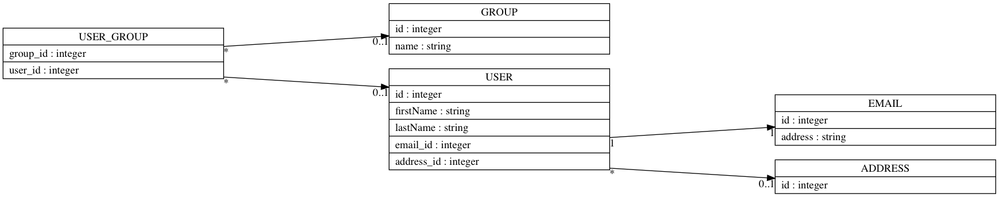

# doctrineviz

[](https://travis-ci.org/janalis/doctrineviz)
[](https://insight.sensiolabs.com/projects/dc69f3e1-060d-4ac8-9fb2-94ced25992f2)

Render a graphical representation of a Doctrine2 mapped database.

## Example



## To do

- [ ] Add phpunit tests
- [ ] Add mongoDB support

## Installation

Require package through composer:
```bash
$ composer require janalis/doctrineviz
```

Then, enable the bundle by adding the following line in the `app/AppKernel.php` file of your project:
```php
// app/AppKernel.php

class AppKernel extends Kernel
{
    public function registerBundles()
    {
        //...
        if (in_array($this->getEnvironment(), ['dev', 'test'])) {
            // ...
            // Because the vendor code could be not present, you should check if the bundle is here before using it.
            new Janalis\Doctrineviz\DoctrinevizBundle(),
        }


        // ...
    }

    // ...
}
```

In order to be able to use the graph drawing feature you'll have to install GraphViz (dot executable).

### Mac OS

```bash
$ brew install graphviz
```

### Ubuntu

```bash
$ sudo apt install -y graphviz
```

### Windows

Windows users may [download GraphViZ for Windows](http://www.graphviz.org/Download_windows.php).

## Usage

Into your symfony project:
```bash
$ php app/console doctrine:generate:viz --help
```

## Credits

- [globalcitizen/mysqlviz](https://github.com/globalcitizen/mysqlviz)
- [graphp/graphviz](https://github.com/graphp/graphviz)
